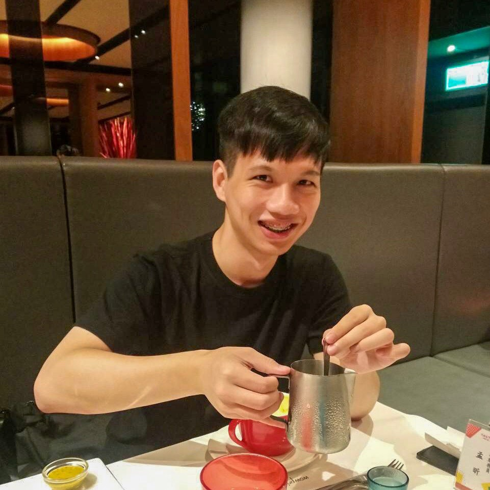

My CV : [Preview](./docs/CV.pdf), <a href="https://github.com/YaoyuanHsu/Yuanster/raw/gh-pages/docs/CV.pdf" target="_self">Download</a>

    
    <h5>Personal lilnks:</h5>
    <ul>
        <li><a href="https://github.com/YaoyuanHsu" target="_self">GitHub</a></li>
        <li><a href="https://www.linkedin.com/in/yaoyuan-hsu/" target="_self">LinkedIn</a></li>
        <li><a href="https://www.facebook.com/profile.php?id=100000597043596" target="_self">Facebook</a></li>
    </ul>
    <h5>University:</h5>
    <ul>
        <li>National Sun Yat-sen University</li><li>National Taipei University_Electrical Engineering</li>
    </ul>

  

Hi, I am **Yuanster**

&nbsp I am attracted by the beauty of programming and having curiosity in many different fields.

&nbsp Desire to learn more knowledge and strengthen abilities.

&nbsp I like programming, so I learn it!!

&nbsp Wish you have a nice day :)

